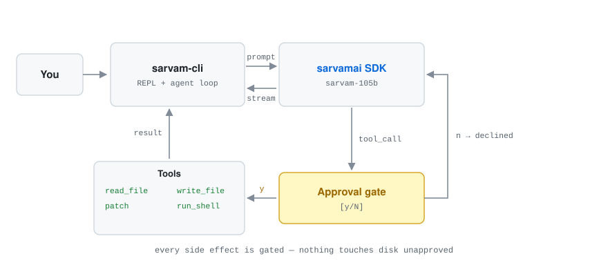

# sarvamai-cli

An open-source agentic CLI coding assistant powered by **Sarvam AI**, built on the official [`sarvamai`](https://www.npmjs.com/package/sarvamai) SDK, with an OpenAI-compatible fallback provider. It reads, writes, and edits files and runs shell commands in your project — with your approval before any side effect.

Think of it as a lightweight, hackable terminal agent that talks to Sarvam's Indic-first LLMs (`sarvam-105b`) via the official SDK, and degrades gracefully to any OpenAI-compatible endpoint as a fallback. MIT-licensed, designed to complement Sarvam's SDK + skills ecosystem and be adoptable upstream.


<sub>Recorded from the real binary with [`scripts/record-demo.py`](scripts/record-demo.py) — no external recorder needed.</sub>

## Why

Sarvam ships an excellent SDK (`sarvamai` on npm/PyPI) and Agent Skills for hosted editors (Claude Code, Cursor, Windsurf). But there's no standalone terminal agent for developers who live in the CLI. `sarvamai-cli` fills that gap — it consumes the official SDK for auth, retries, streaming, and SDK quirks, then layers an agentic tool loop on top.

**Relationship to Sarvam's stack:**

| Layer | What | Example |
|-------|------|---------|
| API client / SDK | `sarvamai` (official) | `npm install sarvamai` |
| Framework provider | Vercel AI SDK provider | `sarvam-ai-sdk` |
| Skills for hosted editors | `sarvamai/skills` (official) | Claude Code, Cursor |
| **Standalone terminal agent** | **sarvamai-cli (this project)** | — |

## Changelog

### v0.2.10
- Fixed: `sarvam --init` exited 0 without writing anything when stdin ended early
  (piped input, Ctrl+D) — the same unguarded readline pattern fixed in the REPL in v0.2.9.
  It now aborts with a clear message and a non-zero status rather than reporting success.
  A partial config is never written: an empty `apiKey` silently shadows the env vars.
- Added: demo GIF and an architecture diagram in the README, both reproducible from
  `scripts/`

### v0.2.9
- Fixed: Ctrl+D / Ctrl+C at any prompt exited silently with status 0 mid-line — readline's
  close event never resolved the pending question. Now exits cleanly (130 on interrupt).
- Fixed: tool output printed twice when the model restated it as its answer
- Fixed: `/model` accepted any string, so a typo failed later as an opaque API error
- Fixed: Ctrl+O redraw dropped already-typed text from the display while keeping it in the buffer
- Added: `! <cmd>` shell escape — runs directly, no model round trip
- `/model` reports when only one model is available instead of prompting for a choice of one

### v0.2.8
- Ctrl+O toggles reasoning display on/off (replaces /reasoning command)
- /model command switches models mid-session without restarting
- Provider interface gains getModel() and setModel() methods
- SARVAM_MODELS exported for model listing
- Welcome message shows current model + available shortcuts

### v0.2.7
- Reasoning tokens collected silently in background buffer (never shown by default)
- /reasoning command toggles inline reasoning display on/off
- /show command dumps the full reasoning log from the session
- Reasoning is passed per-turn to the UI callback (not streamed live)
- Welcome message updated to show available commands

### v0.2.6
- Buffer reasoning_content tokens (same as text) — discard when tool calls present
- Detect and skip duplicate tool calls (model was calling pwd twice)
- Add "do not repeat tool calls" rule to system prompt

### v0.2.5
- Add tool aliases: bash/shell/exec/cmd → run_shell, cat/read → read_file, etc. (model was calling "bash" and getting "Unknown tool")
- List exact tool names in system prompt: "Do NOT invent tool names like bash, cat, exec"
- Compact REPL output: single-line approval, drop "Exit: 0" noise, no redundant confirmation lines
- Strip exit-code lines from tool result display in REPL
- Tell model not to repeat tool output in its response

### v0.2.4
- Buffer streamed text and discard chain-of-thought when tool calls are present (only show final answer)
- Detect premature stops after partial work ("No response requested", "done", etc.) and nudge model to continue
- Add task completion rules to system prompt: complete ALL steps, don't stop after one tool call

### v0.2.3
- Fix `read_file` crashing on directories (EISDIR) — now detects directories and returns a helpful listing
- Constrain model to working directory via dynamic `{CWD}` injection in system prompt
- Auto-recover from empty responses with nudge mechanism

### v0.2.2
- Suppress chain-of-thought leakage via system prompt rules
- Accept `exit`, `quit`, `clear` without leading slash in REPL

### v0.2.1
- Fix deprecated `sarvam-m` model default → `sarvam-105b` (API returns 400 for sarvam-m)
- Fix env var fallback bug: `??` → `||` for API key resolution so empty strings from partial config files don't block env vars

### v0.2.0
- Now backed by the official `sarvamai` SDK — no more hand-rolled fetch
- Reasoning token streaming — `reasoning_content` deltas surfaced live in the REPL
- Cleaner provider separation: Sarvam provider is SDK-backed, OpenAI provider is raw-fetch

## Install

```bash
npm install -g sarvamai-cli   # makes `sarvam` available on your PATH
```

Or build from source:

```bash
git clone https://github.com/indic-ai-contribs/sarvamai-cli.git
cd sarvamai-cli
npm install        # installs sarvamai + typescript
npm run build
npm link           # makes `sarvam` available on your PATH
```

Then get a Sarvam API key from <https://dashboard.sarvam.ai> and run:

```bash
sarvam --init
```

This writes `~/.sarvam/config.json`:

```json
{
  "provider": "sarvam",
  "sarvam": { "apiKey": "sk_...", "model": "sarvam-105b" },
  "openai": { "apiKey": "", "model": "gpt-4o" }
}
```

Alternatively, set environment variables:

```bash
export SARVAM_API_KEY="sk_..."
# or, for the OpenAI-compatible fallback
export OPENAI_API_KEY="sk-..."
```

## Usage

Interactive REPL:

```bash
sarvam
```

Inside the REPL, `!` runs a shell command directly — no model round trip, no approval prompt,
since you typed the command yourself:

```
❯ ! git status
❯ ! npm test
```

Commands the *model* chooses to run still go through the usual approval gate.

Single prompt (non-interactive):

```bash
sarvam "add a .gitignore for a Python project"
sarvam "find and fix the off-by-one in src/parser.ts"
```

Force a provider / model:

```bash
sarvam --provider openai --model gpt-4o "refactor utils.ts"
sarvam -p sarvam -m sarvam-105b "write a test for the auth flow"
```

Auto-approve all tool calls (use with care):

```bash
sarvam --approve never "run the tests and report failures"
```

Sarvam-native reasoning effort (streams thinking tokens in the REPL):

```bash
sarvam --reasoning-effort high "design a rate-limiter for this API"
```

All flags:

```
  -p, --provider <name>           sarvam | openai
  -m, --model <name>              Model name (sarvam-105b, gpt-4o, ...)
      --base-url <url>            Override the API base URL (OpenAI provider only)
      --approve <mode>            always | never  (default: prompt each time)
  -t, --temperature <n>           Sampling temperature (0–2)
      --reasoning-effort <lvl>    low | medium | high  (Sarvam only)
      --init                      Create ~/.sarvam/config.json interactively
  -h, --help                      Show help
```

## Tools

The agent has four tools, all with approval prompts before any mutation:

| Tool | Description |
|------|-------------|
| `read_file` | Read a file (with line numbers, offset/limit paging) |
| `write_file` | Write/overwrite a file (creates parent dirs) |
| `patch` | Targeted find-and-replace edit on a file |
| `run_shell` | Run a shell command, return stdout+stderr |

## Architecture

<picture>
  <source media="(prefers-color-scheme: dark)" srcset="docs/architecture-dark.svg">
  
</picture>

Every side effect is gated. The model can propose a write, a patch, or a shell command, but nothing touches your disk until you approve it — and a decline is fed back as a tool result so the agent can adapt rather than stall.

```
bin/sarvam.ts        CLI entrypoint — flag parsing, config loading, mode dispatch
src/
  config.ts          ~/.sarvam/config.json + env var resolution
  types.ts           Shared message/tool/provider types
  providers/
    sarvam.ts        Sarvam provider — backed by the official sarvamai SDK
    openai.ts        OpenAI-compatible provider — raw fetch + SSE, works with any /v1 endpoint
  tools/
    index.ts         Tool definitions + runtime with approval gating
  agent/
    loop.ts          Agent loop: stream → tool calls → results → repeat
  ui/
    repl.ts          Interactive REPL + single-prompt mode with streaming
  util/
    sse.ts           Minimal async SSE parser (used by the OpenAI provider)
```

**Runtime dependencies:** `sarvamai` (the official Sarvam SDK). The OpenAI provider uses Node 20's built-in `fetch` — no additional dependencies.

### Why two providers?

The **Sarvam provider** uses `SarvamAIClient` from the official `sarvamai` package. This gives us:
- Correct auth via `apiSubscriptionKey` (the SDK handles the header)
- Built-in retries and error handling (SDK throws typed `SarvamAIError` subclasses)
- Proper SSE stream parsing (SDK returns an `AsyncIterable<ChatCompletionChunk>`)
- Access to Sarvam-native extras: `reasoning_effort`, `reasoning_content`, `wiki_grounding`

The **OpenAI provider** is a thin raw-fetch client that works with any OpenAI-compatible endpoint (OpenAI, Groq, Together, Ollama, LM Studio). It exists as a fallback for users who don't have a Sarvam key yet or want to use a different model.

## Programmatic use

```typescript
import { SarvamProvider, runAgent } from "sarvamai-cli";

const provider = new SarvamProvider({ apiKey: process.env.SARVAM_API_KEY! });
const history = await runAgent([], "list files in the current directory", {
  provider,
  cwd: ".",
  approve: async () => true,
  onText: (chunk) => process.stdout.write(chunk),
  onReasoning: (chunk) => process.stderr.write(`[thinking] ${chunk}`),
});
```

## Config resolution order

1. CLI flags (`--provider`, `--model`, etc.)
2. Environment variables (`SARVAM_API_KEY`, `OPENAI_API_KEY`)
3. `~/.sarvam/config.json`

## Notes on the Sarvam SDK

- Package: `npm install sarvamai` (v1.1.7+)
- Client: `new SarvamAIClient({ apiSubscriptionKey: "sk_..." })`
- Chat: `client.chat.completions({ model, messages, stream: true, tools })`
- Streaming returns `AsyncIterable<ChatCompletionChunk>` — each chunk has `choices[0].delta`
- `delta.content` can be `null` when reasoning consumes the token budget — the provider guards for this
- `delta.reasoning_content` carries thinking tokens (Sarvam-native) — surfaced in the REPL
- Auth failures throw `ForbiddenError` (Sarvam returns 403, not 401)

## Contributing

PRs welcome. This is an open-source community project — see `AUTHORS` for contributors. The goal is a clean, ecosystem-aligned codebase that Sarvam (or anyone) can adopt or fork.

To add a new tool: add a handler in `src/tools/index.ts` (a `ToolDef` + `run` function), then register it in the `TOOLS` array. The agent loop picks it up automatically.

To add a new provider: implement the `Provider` interface in `src/types.ts`, then wire it in `bin/sarvam.ts`'s `buildProvider`.

## License

MIT — see [LICENSE](LICENSE).
